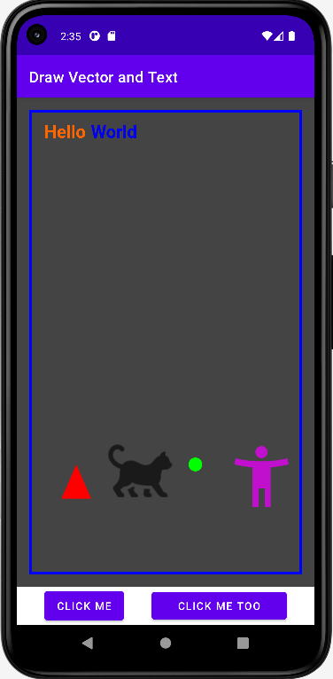

# Hello World

## Shows some vector graphics with Kotlin

This Kotlin app is based the Empty Activity template.

The image view is drawn with:
 * an open rectangle
 * a dot
 * a filled triangle
 * a vector asset drawn as a bitmap
 * a bitmap
 * word wrapped texts in alternating colors

