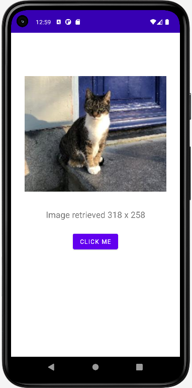

# Hello World

## Retrieve and display an Image with Kotlin

This Kotlin app is based the Empty Activity template.

The main screen contains three widgets, one of them being an image which is filled on clicking the button.

